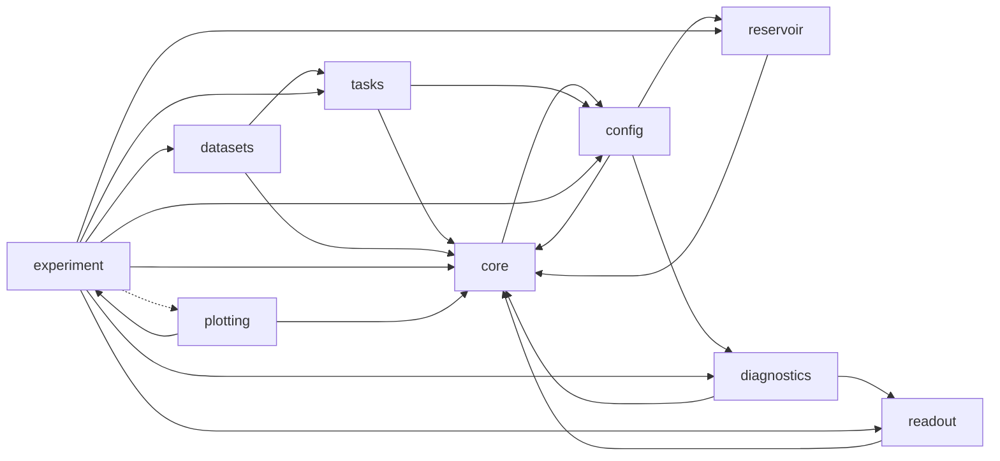

# モジュール地図

`src/rc_basics_lab/` の **110 モジュール**を層ごとに並べる。

**このファイルは生成物である。** 手で直さず `uv run python scripts/module_map.py` を実行する (`tests/test_module_map.py` が生成し直した結果と照合する)。
各行の要約は各モジュールの冒頭 docstring の1行目で、正本はコード側にある。

## 目的から入口へ

| やりたいこと | まず開く |
|---|---|
| 実験を1本読む | `experiment/pipeline.py` -> `experiment/runner.py` |
| 手法の違いがどこにあるか | `readout/design.py` の `_layout_of` (分岐はここだけ) |
| リザバーを足す | `reservoir/protocol.py` と `reservoir/registry.py` |
| 図を1枚直す | `plotting/style.py` の `new_figure` / `save_png` から辿る |
| 設定を1つ足す | `config/0N.py` の dataclass -> 値を変えたら出力が変わるテスト |

## 依存の向き

**実際の import から起こしている**

実線が module-level の import、**破線が関数内の import** である。

**逆流させない。** `experiment` は `plotting` を module-level import しない
(D-53、作図は関数内 import)。`tasks` と `metrics*` は純関数層で
I/O を持たない (D-59)。外部 I/O は `datasets` だけ。

## 層ごとのモジュール

### `core/` — パッケージ直下の単体モジュール (型・指標・入口の道具)

| モジュール | 何をするか |
|---|---|
| `cli.py` | 実験の run スクリプトが共有する引数解析 |
| `meta.py` | 実行メタ情報の収集 |
| `metrics.py` | 誤差指標 (D-02) |
| `metrics_detection.py` | 異常検知の評価指標 (D-54 / D-55 / D-62) |
| `metrics_significance.py` | 有意性の指標 (符号検定) —— **純関数層** (D-59 / D-91) |
| `overrides.py` | ``--set key.path=value`` による設定の上書き |
| `seeds.py` | 乱数ストリームの分離 (D-06) |
| `types.py` | プロジェクト共通の型エイリアス |

### `config/` — 実験ごとの設定 dataclass と読み込み規律

| モジュール | 何をするか |
|---|---|
| `config/_common.py` | 設定 YAML から dataclass を構築する共通ローダ (``config`` package の土台) |
| `config/anomaly05.py` | 実験05 (センサー時系列の異常検知) の設定 dataclass 群 (D-13) |
| `config/anomaly05_sweep.py` | 実験05 の掃引の格子 (5-C プロトコル感度 / 5-D N と性能) の設定 (D-13) |
| `config/capacity03.py` | 実験03 (メモリ容量・情報処理容量) の設定 dataclass 群 (D-13) |
| `config/chaos04.py` | 実験04 (カオス時系列の自由走行予測) の設定 dataclass 群 (D-13) |
| `config/esp02.py` | 実験02 (ESP・スペクトル半径・リーク率) の設定 dataclass 群 (D-13) |
| `config/experiment01.py` | 実験01 (What is RC) の設定 dataclass 群 (D-13) |

### `tasks/` — 課題 (データ生成)。**純関数層** —— I/O もリザバーも知らない

| モジュール | 何をするか |
|---|---|
| `tasks/anomaly.py` | 異常検知の課題層 —— 系列の器・前処理・合成源 (D-57 / D-59 / D-60) |
| `tasks/base.py` | 課題データの共通形式 |
| `tasks/chaotic.py` | カオス時系列の課題 (実験04) —— Lorenz の生成と、標準化の単一の真実 (D-41) |
| `tasks/delay_parity.py` | 遅延パリティ課題 (D-07) |
| `tasks/mackey_glass.py` | Mackey-Glass 系列の生成 (仕様 §3 未確定1 の決定値) |
| `tasks/narma.py` | NARMA10 系列の生成 (D-29 / D-30) |

### `datasets/` — 外部データの取得・キャッシュ・SHA256。**I/O を持つ唯一の場所**

| モジュール | 何をするか |
|---|---|
| `datasets/__main__.py` | ``python -m rc_basics_lab.datasets`` の入口 (``make data-05``) |
| `datasets/cli.py` | ``make data-05`` の実体 —— 実データ源をキャッシュへ取ってくる薄い CLI |
| `datasets/fetch.py` | 外部データセットの取得・照合・キャッシュ (D-58 / D-59) |
| `datasets/manifest.py` | マニフェスト CSV の読み取り (出典・ライセンス・SHA256 の単一の真実) |
| `datasets/mgab.py` | MGAB (Mackey-Glass Anomaly Benchmark) の取得と読み取り |
| `datasets/ucr.py` | UCR Time Series Anomaly Archive (2021) の取得と読み取り |

### `reservoir/` — リザバー本体と、モデルを足すための接合面

| モジュール | 何をするか |
|---|---|
| `reservoir/_kernel.py` | リザバー実装が共有する更新式と検査 (非公開モジュール) |
| `reservoir/deep.py` | 深層 ESN (層を積んだリザバー) |
| `reservoir/esn.py` | Echo State Network の最小実装 |
| `reservoir/protocol.py` | リザバーの接合面 — **モデルを足すときに満たすべき面** |
| `reservoir/registry.py` | リザバーの生成口 — **``ESN(...)`` を直接呼ぶ場所を1つにする** |
| `reservoir/ring.py` | リング結合リザバー (SCR: Simple Cycle Reservoir) |

### `readout/` — 特徴設計 (FeatureSpec)・リッジ回帰・交差検証

| モジュール | 何をするか |
|---|---|
| `readout/autoregressive.py` | 自由走行 (closed-loop) —— 学習済み read-out の出力を次時刻の入力へ戻す実行系 |
| `readout/cross_validation.py` | 時系列の交差検証 — alpha を1つの検証区間ではなく複数の分割で選ぶ |
| `readout/design.py` | 設計行列の構築 — 3ベースラインを分ける唯一の場所 |
| `readout/ridge.py` | リッジ回帰 (閉形式) と検証分割による alpha 選択 |

### `diagnostics/` — ESP / 容量 / IPC / リアプノフ。``X`` だけを見る

| モジュール | 何をするか |
|---|---|
| `diagnostics/_capacity.py` | 容量測定 (MC / IPC) の共有カーネル (非公開モジュール) |
| `diagnostics/base.py` | 診断層のインターフェース (D-01) |
| `diagnostics/dummy.py` | 最小の診断実装 (移植性テストの被験体) |
| `diagnostics/esp.py` | エコー状態性 (ESP) と条件付き Lyapunov 指数の診断 (実験 2-A / 2-B / 2-C) |
| `diagnostics/ipc.py` | 情報処理容量 (IPC) の診断 (実験 3-B) |
| `diagnostics/lyapunov.py` | 最大 Lyapunov 指数の数値推定 (実験04、D-42) |
| `diagnostics/memory_capacity.py` | 線形メモリ容量 (MC) の診断 (実験 3-A) |
| `diagnostics/state_space.py` | 状態空間の広がりを見る診断 (PCA) |
| `diagnostics/timescale.py` | 状態の実効時定数を自己相関から測る診断 (実験 2-B) |

### `experiment/` — 合成層。実験の骨格と成果物の書き出し

| モジュール | 何をするか |
|---|---|
| `experiment/anomaly.py` | 実験 5-A / 5-B の配線 —— 1レプリケート = 1前処理 = 6系統の同一行 (D-05 / D-57) |
| `experiment/anomaly_pipeline.py` | 1コマンドで 05 の成果物をそろえる経路 (仕様 §4 T5) |
| `experiment/anomaly_ranking.py` | 順位と「対照と区別できるか」の印 (5-C / 5-D が共有する純関数層、D-78) |
| `experiment/anomaly_rows.py` | 05 の成果物の行 dataclass と CSV 列 (5枚ぶん) |
| `experiment/anomaly_score.py` | 異常スコアの構成器 —— 6系統を分ける唯一の場所 (D-61 / D-05) |
| `experiment/anomaly_sources.py` | ``dataset.source`` から系列源の辞書を作る唯一の場所 (D-71 / D-59) |
| `experiment/anomaly_sweep.py` | 実験 5-C (プロトコル感度) / 5-D (N と性能) の掃引 (D-57 / D-78 / D-79) |
| `experiment/anomaly_threshold.py` | 運用閾値の決定と閾値掃引 (5-B) —— テストラベルは**引数に取らない** (D-56) |
| `experiment/attractor.py` | 自走軌道を数値で評価する純関数層 (D-43 / D-45 / D-46) |
| `experiment/capacity.py` | 実験 3-A / 3-B / 3-B' の配線層 —— ESN と容量診断をつなぐ唯一の場所 |
| `experiment/capacity_bounds.py` | 実験03 の確保軸の上限と検査 (CWE-789 / CWE-400 / CWE-834) |
| `experiment/capacity_pipeline.py` | 1コマンドで 03 の成果物をそろえる経路 (受け入れ条件7) |
| `experiment/capacity_rows.py` | 実験03 の成果物の行 dataclass と、行を組み立てる関数 |
| `experiment/capacity_threshold.py` | しきい値法の比較 —— 既定 (D-27) が総容量をどれだけ削るかの実測 (受け入れ条件3) |
| `experiment/esp.py` | 実験 2-A / 2-B / 2-C の配線層 —— ESN と診断層をつなぐ唯一の場所 |
| `experiment/esp_pipeline.py` | 1コマンドで 02 の7成果物を作る経路 (受け入れ条件7) |
| `experiment/freerun.py` | 実験 4-A (教師強制の1ステップ先予測) と自走の入口の配線 (D-31 / D-44 / D-50) |
| `experiment/freerun_pipeline.py` | 1コマンドで 04 の成果物をそろえる経路 (受け入れ条件6) |
| `experiment/freerun_rows.py` | 実験04 の成果物の行 dataclass と、行からの要約 |
| `experiment/freerun_tasks.py` | 実験04 の課題の組み立てと、区間の検査 |
| `experiment/horizon.py` | 実験 01' —— 自走 84 ステップ先の誤差 (NRMSE84) を測る (D-105) |
| `experiment/narma.py` | 実験 3-C —— 公平な対照での NARMA10 (D-31) |
| `experiment/narma_taps.py` | 実験 3-C' —— タップ数を振って正則化の効き目を測る (D-95) |
| `experiment/pipeline.py` | 1コマンドで5成果物を作る経路 (受け入れ条件5) |
| `experiment/report.py` | 結果の書き出し — ``comparison.csv`` / ``comparison_summary.csv`` / ``meta.json`` |
| `experiment/runner.py` | 実験1-A ランナー — (課題 x 手法 x レプリケート) を回して長形式の行を作る |
| `experiment/split.py` | 時系列の連続分割 (D-05 / D-06) |
| `experiment/stability.py` | 実験 4-C (自走の3態マップ) と 4-D (同じ状態行列への MC / IPC) の配線 |
| `experiment/state_space.py` | 実験1-B — 入力空間とリザバー状態空間の広がりを数値で比べる |
| `experiment/state_updaters.py` | 自走の状態更新器 (``StateUpdater`` アダプタ, D-50) |
| `experiment/state_waveform.py` | リザバー状態の波形に載せる行を組む (FIG-11 追加図5 / D-107) |
| `experiment/summary.py` | (課題, 手法) ごとの NRMSE 集計 (受け入れ条件3) |
| `experiment/symmetry.py` | 実験 3-S: 駆動入力の対称性と IPC の偶数次 (D-116) |
| `experiment/threshold.py` | ESP 判定の閾値感度 —— 既定値 (D-16) が結論を作っていないことの実測 |
| `experiment/valid_time.py` | 有効予測時間の閾値の定義 (D-43 / D-101) |
| `experiment/washout.py` | 実験 2-D の配線層 —— washout 長への性能感度 (D-19) |
| `experiment/waveform_data.py` | 波形図に載せる (真値, 手法 -> 予測) を組む (FIG-11 / D-107) |

### `plotting/` — 作図層

| モジュール | 何をするか |
|---|---|
| `plotting/broken_axis.py` | 縦軸を破断して上限線と実測を1枚に載せる (2-7 / FIG-4) |
| `plotting/capacity_grids.py` | 記事03の図が読む「行 → 格子」の復元 (D-38 の長形式から) |
| `plotting/esp_references.py` | 実験 02 の図が引く文献の参照値 (D-104) |
| `plotting/figures.py` | 記事01の図2枚 |
| `plotting/figures_anomaly.py` | 記事05の図のうち 5-A / 5-B の3枚と、**印の体裁の単一の真実** |
| `plotting/figures_anomaly_sweep.py` | 記事05の図のうち掃引の2枚 (実験 5-C / 5-D) —— **印を必ず可視化する** (D-81) |
| `plotting/figures_capacity.py` | 記事03の図5枚 (実験 3-A / 3-B / 3-B' / 3-C) |
| `plotting/figures_esp.py` | 記事02の図2枚 (実験 2-A / 2-C) |
| `plotting/figures_freerun.py` | 記事04の図5枚 (実験 4-A / 4-B / 4-C / 4-D) |
| `plotting/figures_freerun_time.py` | 自走が外れていく時系列 (FIG-11 追加図4 / D-107) |
| `plotting/figures_horizon.py` | 実験 01' の図 —— 自走 84 ステップ先の誤差と文献値 (D-105) |
| `plotting/figures_ipc_profile.py` | 実験 3-B の (次数 x 遅延) ヒートマップ (``fig_ipc_profile``) |
| `plotting/figures_leak.py` | 実験 2-B: リーク率と実効時定数 (``fig_leak_timescale``) |
| `plotting/figures_mc_sweep.py` | 実験 3-A: 線形メモリ容量の掃引 (``fig_mc_sweep``) |
| `plotting/figures_narma10.py` | NARMA10 の3枚を1枚に畳んだ図 (FIG-12 / C-6) |
| `plotting/figures_narma_taps.py` | 実験 3-C' の図 —— タップ数と正則化の効き目 (D-95) |
| `plotting/figures_stability.py` | 4-C / 4-D の安定性地図 (``fig_stability_map``) |
| `plotting/figures_states.py` | リザバー状態の波形 (FIG-11 追加図5) |
| `plotting/figures_washout.py` | 実験 2-D: washout 長への性能感度 (``fig_washout_sensitivity``) |
| `plotting/freerun_grids.py` | 実験 04 の図が読む「行 -> 点列」の復元と小さなヘルパ (D-96) |
| `plotting/freerun_headlines.py` | 実験 04 の図が使う結論文の生成 (D-96) |
| `plotting/heatmap.py` | 打ち切り・欠測を「データ」に見せないためのヒートマップ補助 (FIG-7 / D-88) |
| `plotting/labels.py` | 図のラベル文字列 — 日本語 / 英語の切り替え (D-10) |
| `plotting/layout.py` | 図のレイアウト補助 —— 注記の折り返し・凡例の外出し・パネル記号 |
| `plotting/narma10_panel.py` | 実験 3-C (NARMA10) のパネルが使う「行 -> 文字列」の変換 |
| `plotting/style.py` | 図のスタイル設定と CJK フォント探索 (D-10) |
| `plotting/waveforms.py` | 予測波形の図 —— 「NRMSE 0.0007」がどう見えるか (FIG-11 / D-107) |
